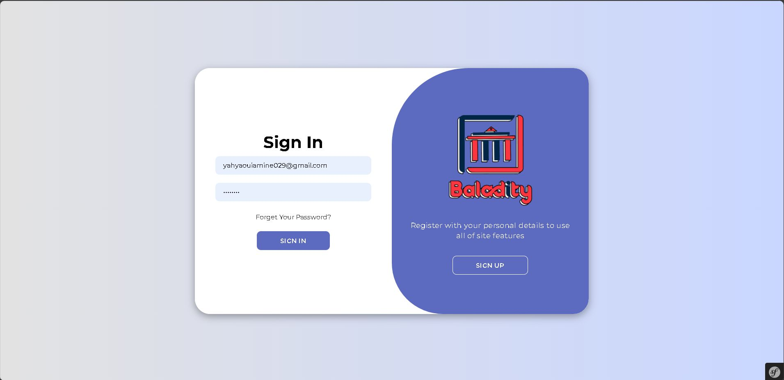
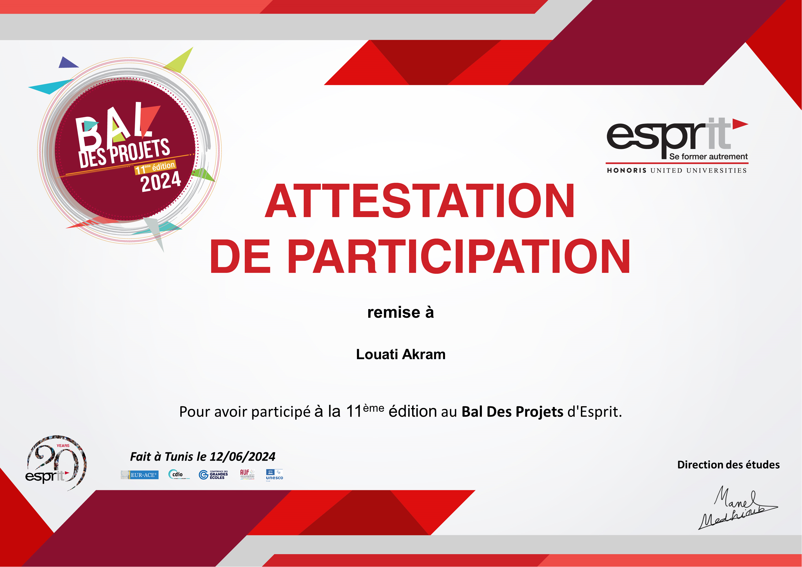
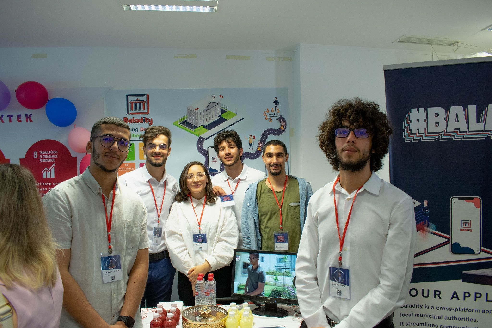

# Baladity Desktop

Baladity is a cutting-edge application designed to bridge the communication gap between citizens and their local
municipal authorities. Our platform empowers both citizens and municipal employees by providing a streamlined, efficient
means of interaction and task management.

## Here is the demo of our application: [Baladity](https://www.youtube.com/watch?v=_SEiQ2j_JvM)

## Cross Platform:

1) [Web](https://github.com/louatiakram/Baladity_Web)
2) [Mobile](https://github.com/louatiakram/Baladity_Mobile)
3) [Desktop](https://github.com/louatiakram/Baladity_Desktop)

## Here are some screenshots of our application:

 
 
 
 
 

## TOP 12 BAL PI 2024:

 
 

